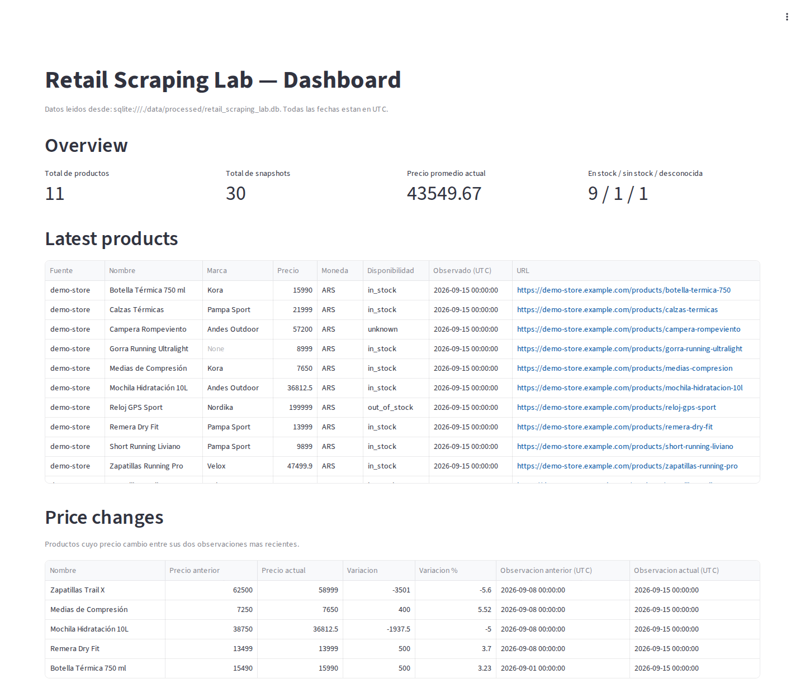

# Retail Scraping Lab

[](https://github.com/lugonesnicolas/retail-scraping-lab/actions/workflows/ci.yml)

**End-to-end retail data acquisition pipeline for tracking product prices, availability and
historical changes.**

It collects product data from a retail catalog, turns raw HTML into validated domain records,
stores every observation as dated history in SQL, and exposes business-oriented analytics in a
dashboard. Every run is traceable, reprocessing is idempotent, and one bad product never takes
down the whole run.

```
Retail Source → Acquisition → Parsing → Normalization → Validation → Historical Storage → Analytics / Dashboard
```

**Current release: [`v0.1.2`](CHANGELOG.md)** · Python 3.12 · requests · lxml · Pydantic ·
SQLAlchemy · SQLite · Streamlit · pytest · GitHub Actions



<sub>Real screenshot of the dashboard after `make run-demo`. The dashboard and CLI labels are in
Spanish, and so are the detailed design docs, ADRs and specs.</sub>

---

## Problem

A retail company needs to periodically collect external product data (its own catalog or a
competitor's) to answer questions such as:

- What is the **current price** of each product?
- How did it **change** since the previous observation?
- Which products are **available**, out of stock, or in an unknown state?
- What does the **history of observations** look like for a given product?
- **Where and when** was each data point observed (data provenance)?

The typical first attempt, a script that scrapes a page and writes a CSV, can't answer these
reliably:

- each run overwrites the previous one, so the history is lost;
- one malformed product crashes the entire run;
- source-specific formats (`"$ 45.999,90"`, `"Sin stock"`) leak into the dataset;
- nobody knows which runs failed, or why.

## Solution

A reproducible pipeline with explicit, separately tested stages and a historical data model:

1. **Acquisition**: fetch raw content from the source (local capture or HTTP).
2. **Parsing**: extract each product's fields as raw text using XPath.
3. **Normalization**: convert that text into domain values (`Decimal` prices, availability
   enum, cleaned strings).
4. **Validation**: check each record against a Pydantic contract.
5. **Historical storage**: persist one dated observation per product and capture in SQLite through
   SQLAlchemy, idempotently.
6. **Analytics / Dashboard**: read-only SQL queries, consumed by a Streamlit dashboard.

Each run is recorded with a status (`success`, `partial` or `failed`) and its errors. An invalid
product is dropped and logged, and the rest of the capture is still stored.

## Architecture

```
tests/fixtures/demo_store/<date>/catalog.html          demo source (one folder per capture)
        │
        ▼
scraping/clients      LocalFileClient | HttpClient     acquisition: raw content
        │
        ▼
scraping/parsers      parse_catalog (lxml + XPath)     parsing: raw text fields per product
        │
        ▼
scraping/normalizers  product_normalizer               normalization: "$ 45.999,90" → Decimal
        │
        ▼
models/product.py     Product (Pydantic)               validation: contract of one observation
        │
        ├──▶ scraping/pipelines   JSON/CSV export per capture
        ▼
repositories          ProductRepository                historical persistence (SQLAlchemy)
        │
        ▼
analytics/queries.py  read-only queries  ──▶  dashboard/app.py (Streamlit)
```

`services/scraping_service.py` orchestrates the use case (one capture → one run), and `cli.py`
exposes it as a Typer CLI.

Each layer has a single responsibility:

| Layer          | Module                                    | Responsibility                                                   |
|----------------|-------------------------------------------|------------------------------------------------------------------|
| Client         | `scraping/clients/`                       | Return raw content for a location. Knows nothing about HTML.     |
| Parser         | `scraping/parsers/product_parser.py`      | Extract fields as text with XPath. Does not convert types.       |
| Normalizer     | `scraping/normalizers/product_normalizer.py` | Apply source formats (es-AR prices, stock labels). No I/O.    |
| Validation     | `models/product.py`                       | Pydantic contract for one observation.                           |
| Repository     | `repositories/product_repository.py`      | Write catalog, snapshots, runs and errors.                       |
| Service        | `services/scraping_service.py`            | Orchestrate a run and its transactions.                          |
| Analytics      | `analytics/queries.py`                    | Read-only SQL queries returning typed dataclasses.               |
| Dashboard      | `dashboard/app.py`                        | Presentation only: no SQL, no business logic.                    |

Adding a new source means writing a new client/parser/normalizer. The model, persistence and
dashboard stay the same. More detail in [`docs/02_architecture.md`](docs/02_architecture.md).

## Data Model

The schema separates **what a product is** from **what it looked like at a given moment**:

```
sources 1──N products 1──N product_snapshots
sources 1──N scrape_runs 1──N scrape_errors
```

- **`Source`**: where data comes from (for example, `demo-store`).
- **`Product`**: the **stable catalog identity** of a product within a source, unique by
  `(source_id, product_url)`, holding the latest observed name, brand and image.
- **`ProductSnapshot`**: a **historical observation**, one row per product per capture, with price,
  currency and availability. `UNIQUE(product_id, scraped_at)` makes loading idempotent.
- **`ScrapeRun`**: one execution over one capture, with its status and counters (found, inserted,
  updated, skipped, errors).
- **`ScrapeError`**: an item- or run-level failure with its type, message and URL.

How a validated record maps to storage:

| Pydantic field (`models/product.py`) | Stored in                          |
|--------------------------------------|------------------------------------|
| `source`                             | `sources.name`                     |
| `product_url`, `name`, `brand`       | `products`                         |
| `price` (`Decimal`, ≥ 0), `currency` (3-letter currency code) | `product_snapshots`     |
| `availability` (enum)                | `product_snapshots.availability`   |
| `captured_at`                        | `product_snapshots.scraped_at`     |

The schema also defines a `categories` table that the current pipeline does not populate yet. Full
detail is in [`docs/03_data_model.md`](docs/03_data_model.md).

## Engineering Decisions

- **Custom pipeline on `requests` + `lxml`, no scraping framework.** Every stage stays explicit and
  testable in isolation; throughput is not the goal.
  [ADR 0001](docs/adr/0001-use-python-custom-scraper.md) ·
  [ADR 0002](docs/adr/0002-use-requests-and-lxml.md)
- **Acquisition as a contract (`ContentClient`).** `LocalFileClient` and `HttpClient` implement the
  same `Protocol`, and the spider receives the client by injection. The demo runs fully offline
  without special-casing any code path.
- **Normalize before validating.** The parser returns raw text, the normalizer applies the source's
  formats (es-AR prices, stock labels), and Pydantic validates the final contract. No layer knows
  the internals of another.
- **Item-level error isolation.** An invalid product becomes a `scrape_error` and the run is marked
  `partial`. A capture only fails as a whole when it can't be read or its structure changed.
- **`captured_at` is when the data was observed, not when it was loaded.** Execution time is
  stored separately in `scrape_runs.started_at`, so reprocessing old captures keeps the timeline
  correct.
- **Idempotency enforced by the database.** `UNIQUE(product_id, scraped_at)` lets a capture be
  reprocessed without duplicating history; skipped snapshots are counted on the run.
- **Tri-state availability (`in_stock`, `out_of_stock`, `unknown`).** A boolean would silently
  turn "unknown" into "out of stock".
- **Separate transactions per run.** The run is committed before its data is written. If
  persisting the data fails, the rollback doesn't erase the evidence: the run is marked `failed`
  with its error in a new transaction.
- **SQLite + SQLAlchemy.** Zero infrastructure for anyone cloning the repo; the database URL is
  configurable. [ADR 0003](docs/adr/0003-use-sqlite-first.md)
- **Analytics layer separated from Streamlit.** Queries (including a window function for price
  changes) are plain functions that return dataclasses and are unit-tested; the dashboard only
  renders them. [ADR 0004](docs/adr/0004-use-streamlit-dashboard.md)
- **CI on GitHub Actions** for every push to `main` and every PR.
  [ADR 0005](docs/adr/0005-use-github-actions.md)

Each feature was built with Spec-Driven Development: `specs/NNN-feature/` contains its `spec.md`,
`plan.md` and `tasks.md`. See [`docs/01_sdd_process.md`](docs/01_sdd_process.md).

## Demo

The demo source, `demo-store`, is a sporting-goods catalog with three weekly captures (2026-09-01,
2026-09-08, 2026-09-15) in [`tests/fixtures/demo_store/`](tests/fixtures/demo_store/). They
deliberately include the cases a real pipeline has to handle:

- **price changes**: some products go down, others go up;
- **stock changes**: products go out of stock and come back;
- **a new product** that appears in the third capture;
- **unknown availability** (`"Consultar disponibilidad"`);
- **a missing brand**;
- **an invalid price** (`"Consultar precio"`) that can't be parsed.

`make run-demo` processes the three captures in order. Actual output (CLI labels are in Spanish:
*Items / Válidos / Errores / Snapshots nuevos / omitidos* = items / valid / errors / new / skipped
snapshots):

```
                           Resumen por captura
┏━━━━━━━━━━━━┳━━━━━━━━━┳━━━━━━━┳━━━━━━━━━┳━━━━━━━━━┳━━━━━━━━━━━━━━━━━━┳━━━━━━━━━━━━━━━━━━━━┓
┃ Captura    ┃ Estado  ┃ Items ┃ Validos ┃ Errores ┃ Snapshots nuevos ┃ Snapshots omitidos ┃
┡━━━━━━━━━━━━╇━━━━━━━━━╇━━━━━━━╇━━━━━━━━━╇━━━━━━━━━╇━━━━━━━━━━━━━━━━━━╇━━━━━━━━━━━━━━━━━━━━┩
│ 2026-09-01 │ success │    10 │      10 │       0 │               10 │                  0 │
│ 2026-09-08 │ partial │    10 │       9 │       1 │                9 │                  0 │
│ 2026-09-15 │ success │    11 │      11 │       0 │               11 │                  0 │
└────────────┴─────────┴───────┴─────────┴─────────┴──────────────────┴────────────────────┘
```

The result is a history of **11 products and 30 observations**. The unparseable price is recorded
as a `NormalizationError` with its product URL, and the other nine products of that capture are
still stored. Running `make run-demo` again adds nothing: every observation is reported as
skipped. Each capture is also exported to `data/exports/demo-store_<date>.json`.

## Dashboard

`make dashboard` starts a Streamlit app that reads the SQLite database exclusively through
`analytics/queries.py`:

| View            | Business question                                              | Query                                   |
|-----------------|----------------------------------------------------------------|-----------------------------------------|
| Overview        | How many products and observations? Average current price? How many are in stock / out of stock / unknown? | `count_products`, `count_snapshots`, `average_current_price`, `current_availability_breakdown` |
| Latest Products | What is each product's current price, source and observation time? | `latest_snapshots`                  |
| Price Changes   | What changed between each product's two latest observations?  | `price_changes` (window function)       |
| Price History   | How did one product's price evolve over time?                  | `price_history`                         |
| Scrape Runs     | Which runs happened and how did they end?                      | `recent_scrape_runs`                    |
| Errors          | What failed, where, and why?                                   | `recent_errors`                         |

With the demo data, *Price Changes* shows, for example, that the Trail X running shoes dropped from
$62,500 to $58,999 (−5.6%) and the compression socks rose from $7,250 to $7,650 (+5.5%). All
timestamps are UTC. If the database doesn't exist yet, or was created with an older schema, the
dashboard shows the commands to fix it instead of a traceback. More in
[`dashboard/README.md`](dashboard/README.md).

## Running Locally

Requirements: Python 3.12+, `git` and `make`.

```bash
git clone https://github.com/lugonesnicolas/retail-scraping-lab.git
cd retail-scraping-lab
python3 -m venv .venv
source .venv/bin/activate        # Windows: .venv\Scripts\activate
make install                     # install the package and dev tools
make run-demo                    # run the full pipeline and store the history
make dashboard                   # start the dashboard at http://localhost:8501
```

Run all commands from the repository root. Configuration has sensible defaults and needs no file;
to override it, copy `.env.example` to `.env` (for example, `RSL_DATABASE_URL` to use another
database).

| `make`           | Without `make`                                             | What it does                            |
|------------------|------------------------------------------------------------|-----------------------------------------|
| `make install`   | `pip install -e ".[dev]"`                                  | Install dependencies                    |
| `make run-demo`  | `python -m retail_scraping_lab.cli scrape-demo --persist`  | Full pipeline + history in SQLite       |
| `make dashboard` | `streamlit run dashboard/app.py --server.headless true`    | Start the dashboard                     |
| `make check`     | `ruff check . && ruff format --check . && mypy && pytest`  | Lint, format, types and tests           |
| `make reset-db`  | `python -m retail_scraping_lab.cli init-db --reset`        | Drop and recreate the database          |

Other CLI options:

```bash
python -m retail_scraping_lab.cli scrape-demo --capture 2026-09-08 --persist   # a single capture
python -m retail_scraping_lab.cli scrape-demo                                  # export only, no database
python -m retail_scraping_lab.cli --help
```

## Testing and Quality

```bash
make check
```

This runs, in order:

- **Ruff lint** (`ruff check .`);
- **formatting check** (`ruff format --check .`);
- **mypy** static type checking over `src/`, `tests/` and `dashboard/`;
- **pytest**, 68 tests, fully offline against local fixtures:
  - **unit**: parser on local HTML, normalizer with parametrized price/availability/text cases,
    `HttpClient` with `requests` mocked via `monkeypatch`, repository on in-memory SQLite,
    analytics queries;
  - **integration**: ingesting all three captures into the expected history, idempotent
    reprocessing, `partial` runs with persisted errors, a regression test for the persistence-failure
    bug, unreadable captures, the CLI via `CliRunner`;
  - **dashboard smoke test**: `dashboard/app.py` executed headlessly with
    `streamlit.testing.AppTest`, including the "no database" and "outdated schema" states.

GitHub Actions runs the same checks on every push to `main` and every pull request
([`ci.yml`](.github/workflows/ci.yml)). A second, manually triggered workflow
([`scrape.yml`](.github/workflows/scrape.yml)) runs the full pipeline and publishes the exports and
the SQLite database as build artifacts.

## Project Status

**Current release: `v0.1.2`**, a complete vertical slice on a reproducible demo source. Following
only this README, you can clone the repository, run the full pipeline, accumulate historical
snapshots, run the test suite and explore the results in the dashboard. `v0.1.1` added a fix on
top of `v0.1.0` (the dashboard now detects a database created with an older schema instead of
crashing); `v0.1.2` polishes the documentation and portfolio presentation, with no functional
changes. See the [CHANGELOG](CHANGELOG.md).

What this release deliberately does **not** attempt yet:

- **Real production scraping.** The source is a local catalog with dated captures. `HttpClient`
  exists and is tested, but no live spider uses it yet.
- **Scheduling.** Runs are triggered manually (CLI or `workflow_dispatch`).
- **Distributed execution.** Single process, single machine.
- **Multiple retailers.** One source and one currency; the average price does not convert
  currencies.
- **PostgreSQL.** SQLite only for now; the database URL is configurable.
- **Schema migrations.** No Alembic yet; a local database from an older version is recreated with
  `make reset-db`.
- **Anti-bot handling.** No headless browsers, proxies or evasion techniques, by design.

### Roadmap (v0.2+)

- A real HTTP source built for scraping practice, with `robots.txt` compliance, rate limiting and
  retries.
- Alembic migrations and PostgreSQL support.
- Scheduled runs on GitHub Actions.
- Category-level analysis, comparisons across arbitrary captures and recurring-error detection
  (see [`docs/05_business_questions.md`](docs/05_business_questions.md)).

### Ethical scope

Low-volume scraping only, against local fixtures or public sources intended for practice,
respecting `robots.txt` and terms of use whenever the target is a real site. No personal data is
collected. LinkedIn is never scraped and no social-media activity is automated. See
[`docs/04_scraping_strategy.md`](docs/04_scraping_strategy.md).

## Repository Structure

```
src/retail_scraping_lab/
  scraping/        clients · parsers · normalizers · spiders · pipelines (export)
  models/          Pydantic contract and SQLAlchemy schema
  repositories/    database writes
  services/        use-case orchestration (one run per capture)
  analytics/       read-only queries
  config/ core/    settings, exceptions, logging
  cli.py           Typer commands
dashboard/         Streamlit app
tests/             unit · integration · fixtures (demo catalog)
docs/              vision, architecture, data model, scraping strategy, ADRs
specs/             one folder per feature (spec, plan, tasks)
```

## Documentation

Detailed documentation is written in Spanish.

- [`docs/`](docs/): project vision, [SDD process](docs/01_sdd_process.md),
  [architecture](docs/02_architecture.md), [data model](docs/03_data_model.md),
  [scraping strategy](docs/04_scraping_strategy.md),
  [business questions](docs/05_business_questions.md) and
  [AI agents usage](docs/06_ai_agents_usage.md).
- [`docs/adr/`](docs/adr/): Architecture Decision Records.
- [`specs/`](specs/): Spec-Driven Development records, one folder per feature
  (`001-project-foundation` … `009-portfolio-release-polish`).
- [`CHANGELOG.md`](CHANGELOG.md): release history.

## License

[MIT](LICENSE) © Nicolas Ezequiel Lugones
